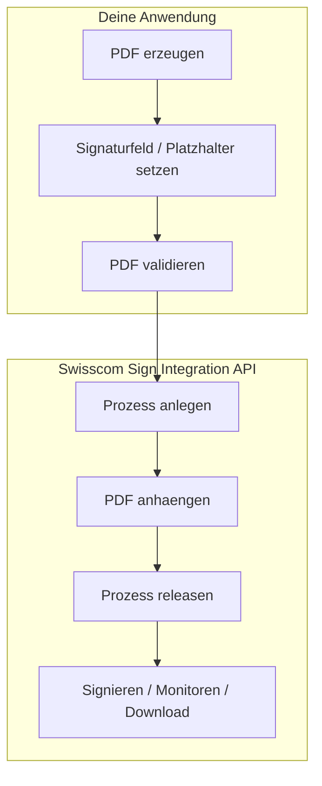
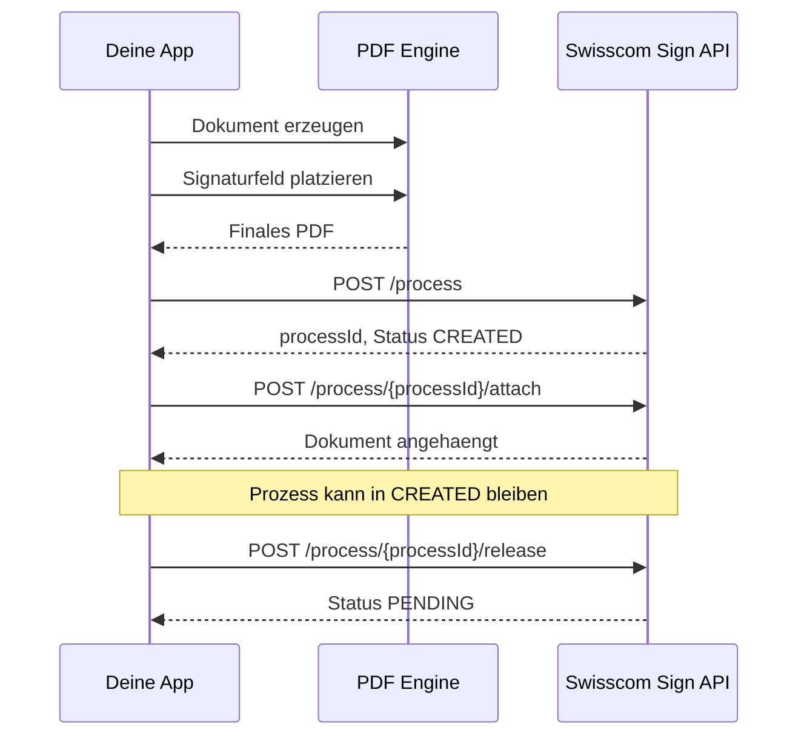

# Swisscom Sign Integration API - Uebersicht

> Stand: 2026-03-04  
> Quelle: oeffentlich erreichbare Swisscom Sign Guide-Seite und Swisscom Trust Services Help Center.

## 1. Kurzfazit

Die Swisscom Sign Integration API ist eine REST-API zum **Erstellen, Freigeben und Ueberwachen von Signaturprozessen**. Ein Prozess durchlaeuft die Zustaende **CREATED**, **PENDING**, **COMPLETED** und **EXPIRED**. Die API erlaubt insbesondere das Anlegen eines Prozesses, das Anhaengen von PDF-Dokumenten, das Freigeben des Prozesses, das Oeffnen fuer bestimmte Unterzeichner, das Abfragen von Status- und Prozessdaten sowie das Herunterladen von Dateien und Audit-Records.

Wichtig fuer dein Anliegen: **Fuer visual signature placement gibt es in der oeffentlichen Integration-API keinen eigenen Placement-Endpoint.** Swisscom dokumentiert ausdruecklich, dass die **Positionierung der visuellen Signatur beim Erstellen des Dokuments** erfolgen muss und vor dem Release oft vergessen wird. Das heisst: Wenn du die sichtbare Signatur an einer bestimmten Stelle haben willst, musst du das **im PDF selbst vorbereiten**, nicht ueber einen separaten API-Call waehrend des Prozess-Lifecycles.

## 2. Was die API kann

### Kernfaehigkeiten
- Signaturprozess anlegen
- PDF an Prozess anhaengen
- Prozess manuell durch Benutzer konfigurieren
- Prozess ohne manuelles Setup freigeben
- Einen freigegebenen Prozess fuer eine bestimmte Person direkt oeffnen
- Prozessdaten abrufen
- Status abrufen
- Originaldatei und signierte Datei herunterladen
- Audit- / Record-Daten abrufen
- OAuth2-gesicherte Maschinenintegration

### Zustaende
- **CREATED** - Prozess wurde angelegt, Dokumente koennen angehaengt werden
- **PENDING** - Prozess wurde freigegeben, es wird auf Signaturen gewartet
- **COMPLETED** - alle erforderlichen Signaturen liegen vor
- **EXPIRED** - Prozess ist abgelaufen, mindestens eine Signatur fehlt

## 3. Endpoints

| Methode | Endpoint | Zweck | Mindeststatus |
|---|---|---|---|
| POST | `/process` | Neuen Signaturprozess erstellen | - |
| POST | `/process/{processId}/attach` | PDF an bestehenden Prozess anhaengen | CREATED |
| POST | `/process/{processId}/setup` | Benutzer fuehrt manuelles Setup durch | CREATED |
| POST | `/process/{processId}/release` | Prozess ohne manuelles Setup freigeben / starten | CREATED |
| POST | `/process/{processId}/open/{personId}` | Freigegebenen Prozess fuer bestimmte Person oeffnen | PENDING |
| GET | `/process/{processId}` | Prozessmodell lesen | CREATED |
| GET | `/process/{processId}/status` | Prozessstatus lesen | CREATED |
| GET | `/process/{processId}/file/{fileId}` | Original- oder signierte Datei herunterladen | CREATED / COMPLETED |
| GET | `/process/{processId}/record` | Audit-Records abrufen | CREATED |

## 4. API-Fluss

```mermaid
flowchart TD
    A[POST /process] --> B[Status: CREATED]
    B --> C[POST /process/{processId}/attach]
    C --> D{Weiteres Setup?}
    D -->|Manuell| E[POST /process/{processId}/setup]
    D -->|Direkt| F[POST /process/{processId}/release]
    E --> G[Status: PENDING]
    F --> G
    G --> H[POST /process/{processId}/open/{personId}]
    G --> I[GET /process/{processId}/status]
    G --> J[GET /process/{processId}]
    G --> K[GET /process/{processId}/record]
    G --> L{Alle Signaturen vorhanden?}
    L -->|Ja| M[Status: COMPLETED]
    L -->|Nein und abgelaufen| N[Status: EXPIRED]
    M --> O[GET /process/{processId}/file/{fileId}]
```

## 5. Placement der visuellen Signatur

### Die wichtige Antwort auf deine Frage

**Nein, in der oeffentlichen Swisscom Sign Integration API ist kein eigener Schritt dokumentiert, mit dem du die sichtbare Signatur positionierst, ohne den Signaturprozess zu starten.**

Swisscom schreibt beim Endpoint `POST /process/{processId}/release` sinngemaess:
- vor diesem Schritt werde oft die Positionierung der visuellen Signatur vergessen
- **diese muss beim Erstellen des Dokuments gemacht werden**

Das bedeutet praktisch:

1. Du erstellst zuerst das PDF.
2. In diesem PDF definierst du bereits den Bereich / das Feld / den Platzhalter fuer die sichtbare Signatur.
3. Erst danach haengst du das PDF an den Prozess an.
4. Danach kannst du den Prozess spaeter freigeben.

### Mermaid: Placement-Logik

```mermaid
flowchart LR
    A[PDF erzeugen] --> B[Signaturfeld / sichtbaren Platzhalter im PDF vorbereiten]
    B --> C[PDF speichern]
    C --> D[POST /process]
    D --> E[POST /process/{processId}/attach]
    E --> F[Prozess bleibt CREATED]
    F --> G[Optional spaeter: POST /process/{processId}/release]
```

### Konsequenz

Wenn du "Placement ohne Start des Signaturprozesses" willst, dann ist der gangbare Weg:

- **Ja, ohne Starten geht es**
- **Aber nicht als eigener Swisscom-Placement-API-Call**
- sondern nur, indem du das **PDF vorab mit Signaturfeld / visueller Signaturzone vorbereitest** und es dann an einen noch nicht freigegebenen Prozess anhaengst

## 6. Was technisch wahrscheinlich gemeint ist

Swisscom Trust Services beschreibt in der Help-Center-Dokumentation zum Einbetten eines signierten Hashes in ein PDF, dass man ein PDF mit einem **blank and pre-filled signature field** erstellt, den noetigen Platz vorhaelt und danach den Signaturwert in dieses Feld einbringt. Zudem verweist Swisscom auf PDF-Library-Anbieter wie iText, PDF Tools, SetaPDF, Intarsys und Skribble fuer die PDF-seitige Umsetzung.

Das ist ein starkes Indiz fuer folgende Architektur:

- Die **Position und visuelle Darstellung** wird auf **PDF-Ebene** vorbereitet.
- Die Swisscom-Sign-API kuemmert sich um den **Signaturprozess**, nicht um ein nachtraegliches grafisches Layouting innerhalb des PDFs.

### Mermaid: Trennung von Verantwortlichkeiten



## 7. Was du konkret tun kannst

### Option A - Sichtbare Signaturzone im PDF vorbereiten
Nutze eine PDF-Library und setze vor dem Upload:
- ein sichtbares Signaturfeld
- feste Koordinaten auf einer bestimmten Seite
- optional vordefinierte Groesse und Appearance

Das ist der sauberste Weg, wenn du die sichtbare Signatur an einem exakten Ort brauchst, ohne den Prozess sofort zu starten.

### Option B - Prozess nur anlegen und PDF anhaengen
Du kannst:
1. `/process` aufrufen
2. `/process/{processId}/attach` aufrufen
3. den Prozess in **CREATED** liegen lassen

Damit ist der Prozess angelegt, das Dokument ist dran, aber noch nicht gestartet. Spaeter kannst du mit `/release` oder `/setup` weitermachen.

### Option C - Manuelles Setup
Falls Swisscoms Setup-UI spaeter noch Konfiguration erlaubt, kannst du den Benutzer ueber `/setup` fuehren. In der oeffentlichen Doku ist aber **nicht** dokumentiert, dass dies ein frei steuerbares API-basiertes Placement fuer die sichtbare Signatur ersetzt.

## 8. Authentisierung

Alle Services benoetigen ein gueltiges OAuth2-Token. Laut Guide wird dafuer der **OAuth2 Client Credentials Flow** mit **Client ID** und **Client Secret** verwendet.

Typische Punkte:
- Client Credentials
- Scopes wie `sswp:process:create` und `sswp:process:read`
- Public Tenant oder Corporate Tenant

## 9. Empfehlung fuer deine Architektur

Wenn dein Ziel ist, **Signaturplacement vor Release** kontrolliert zu machen, wuerde ich es so aufbauen:

1. Dokument in deinem System generieren
2. PDF mit sichtbarem Signaturfeld vorbereiten
3. Optional internen Placement-Editor in deiner Anwendung bauen
4. PDF finalisieren
5. `/process` anlegen
6. `/attach` ausfuehren
7. Prozess erst spaeter mit `/release` starten

### Mermaid: Empfohlene Zielarchitektur



## 10. Offene Punkte / Unsicherheit

Die oeffentliche API-Seite mit dem OpenAPI-Contract war nur teilweise lesbar. Deshalb konnte ich keine vollstaendige Aussage zu Request- und Response-Schemata fuer jedes Modell ableiten. Fuer den Placement-Punkt ist die Guide-Dokumentation aber ziemlich eindeutig: **Placement gehoert in die Dokumentvorbereitung, nicht in einen spaeteren separaten API-Schritt der Integration API.**

## 11. Quellen

1. Swisscom Sign Guide - Getting Started  
   https://sign.swisscom.ch/api-docs/guide/getting-started

2. Swisscom Trust Services - How to embed a signed hash into a PDF-document  
   https://trustservices.swisscom.com/en/support/help-center/how-to-embed-a-signed-hash-into-a-pdf-document

3. Swisscom Trust Services - PDF Library Provider  
   https://trustservices.swisscom.com/en/support/developer-section/pdf-library-providers
